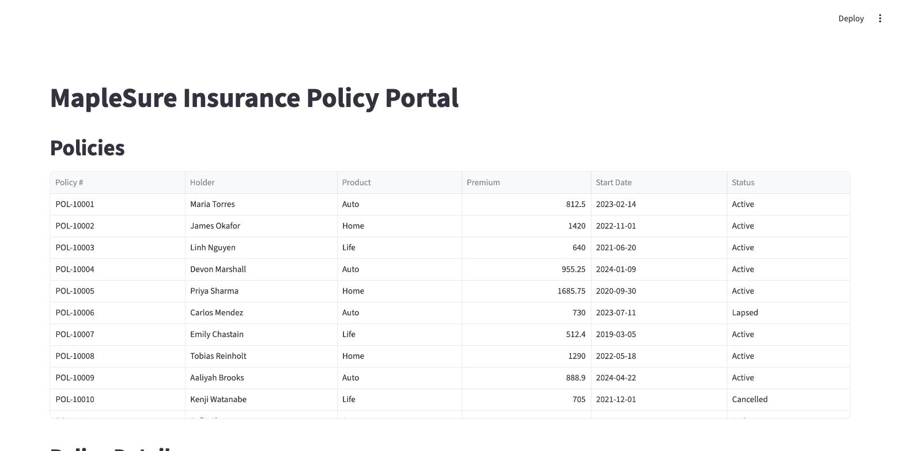
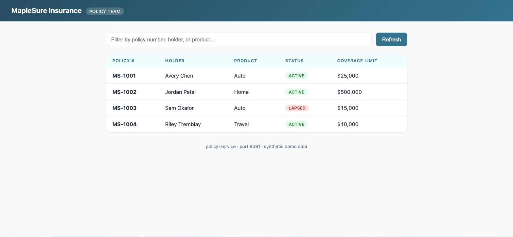
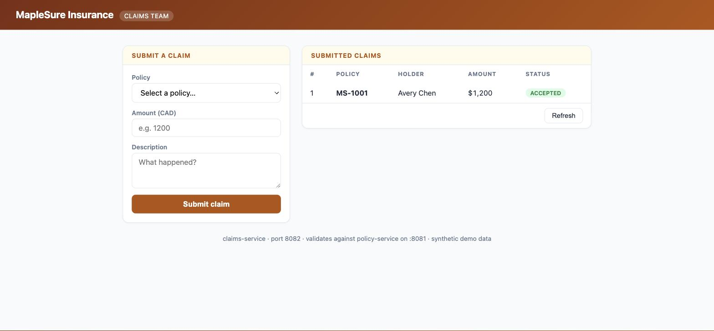
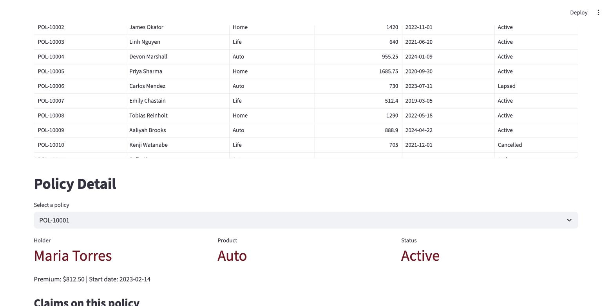
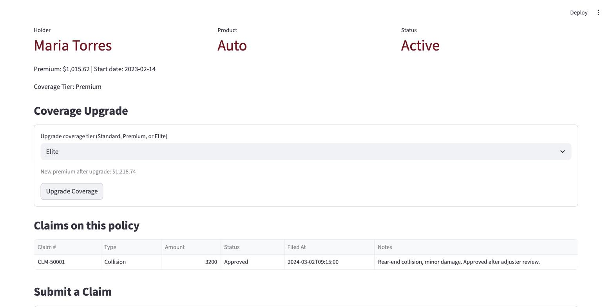
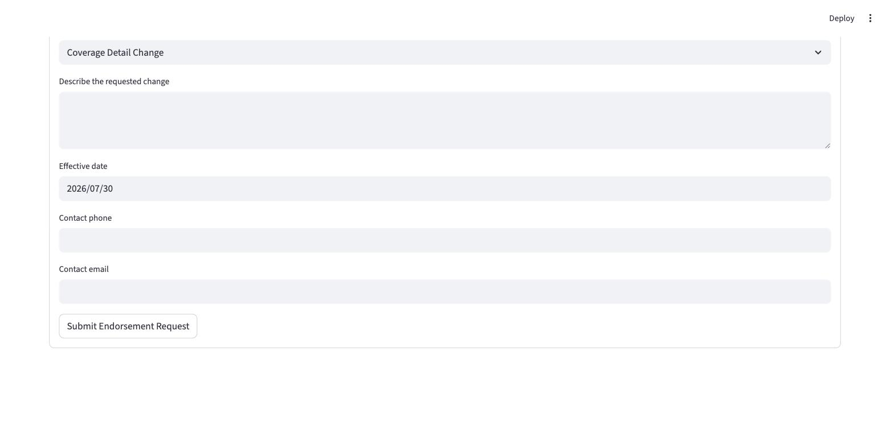
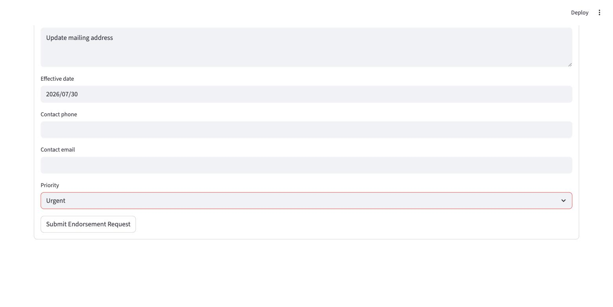
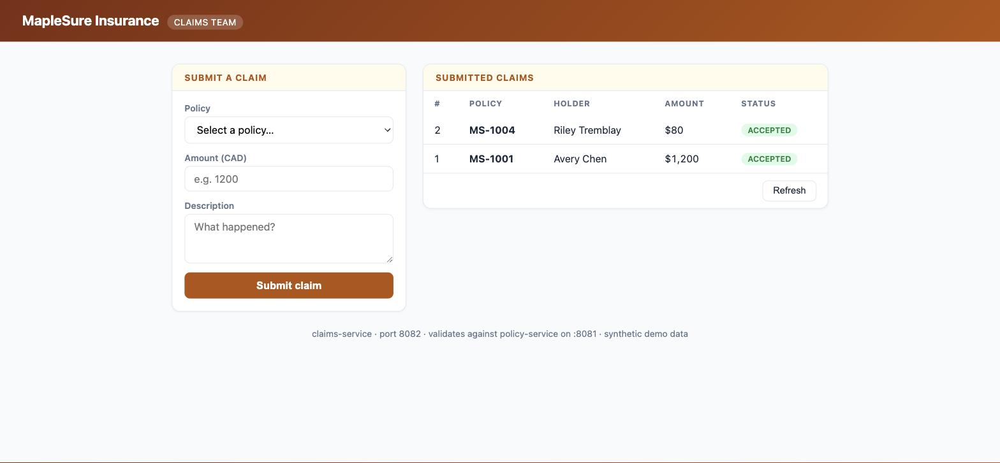
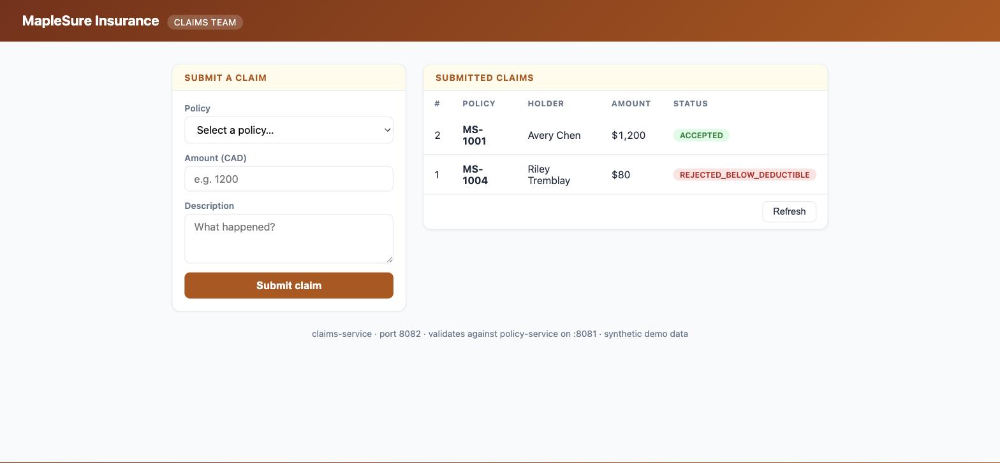
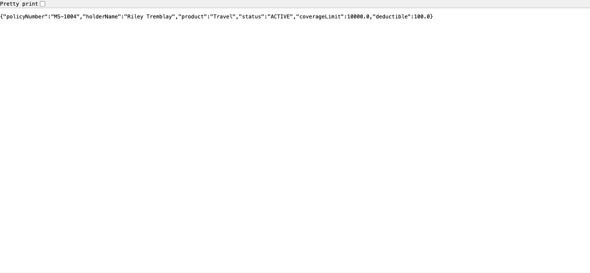

# PolicyCore & ClaimsPortal — What They Are, What's Changing, How It's Tested

For a team that needs the business/functional picture — what each application
does today, what small enhancement is being added to it, how that enhancement
gets proven correct before it ships, and what "everything is running" looks
like in practice.

All data in every application below is **synthetic** — a fictional insurer
("MapleSure Insurance"), fictional policyholders, no real client data anywhere.

---

## The four applications

| Application | Port | Role |
|---|---|---|
| **AMS Console** | 8000 (API) + 5173 (UI) | The console the change is driven from — a developer opens a ticket here, an AI drafts the change, a reviewer approves it file by file, and it's applied to one of the three apps below. |
| **PolicyCore** | 8501 | The policyholder-facing portal — see below. Target of CR-2026-041 and CR-2026-042. |
| **policy-service** | 8081 | Half of ClaimsPortal — serves policy records. |
| **claims-service** | 8082 | Half of ClaimsPortal — claims intake. Target of CR-2026-043. |

**All 5 up looks like this** (health-check pass, in this exact order — start
policy-service before claims-service, since claims-service calls it):

```
Console       :8000  ->  200
Console UI    :5173  ->  200
PolicyCore    :8501  ->  200
policy-service:8081  ->  {"status": "ok"}
claims-service:8082  ->  {"status": "ok"}
```


*PolicyCore (`:8501`) — the policy list every enhancement below builds on.*


*policy-service (`:8081`) — half of ClaimsPortal.*


*claims-service (`:8082`) — the other half, validates against policy-service.*

---

## PolicyCore — the policy administration portal

**What it is today**: the app policyholders and support engineers use to
manage active policies. Three things it already does:

- **Policy list & detail** — view a policyholder's policy, its product type,
  premium, and status.
- **Claim submission** — file a claim against a policy.
- **Endorsement requests** — request a change to an active policy (e.g.
  updating coverage details or personal information on file) through a
  5-field form: endorsement type, requested change, effective date, contact
  phone, contact email.

Two small enhancements are being added to it.

### Enhancement 1 — Coverage-Upgrade Option (CR-2026-041)

**The problem**: a policyholder who wants to move to a higher coverage tier
(e.g. Standard → Premium → a new top tier) has no self-service way to do it —
today that requires a manual back-office process.

**What's being added**: an upgrade control directly on the policy detail
view. Selecting a higher tier recalculates the premium automatically and
saves it — no downgrades in this change, and every existing flow (policy
list, claim submission) keeps working unchanged.

**Worked example** — policy `POL-10001` (Maria Torres, Auto), premium $812.50
at the "Standard" tier:

| Action | Result |
|---|---|
| Before the CR | No tier concept exists at all — the policy just has a premium. |
| Upgrade to "Premium" (×1.25) | Premium recalculates to **$1,015.62** |
| Upgrade "Premium" → "Premium" again (same tier) | Rejected — no same-tier "upgrades" |
| Downgrade "Premium" → "Standard" | Rejected — this CR is upgrades only |
| Upgrade an unknown policy number | Rejected with a clear "not found" error |


*Before — just a premium, no tier concept.*


*After — Coverage Tier: Premium, Premium: $1,015.62 (verified live, not estimated).*

**How it's tested**:
- A generated test suite proves the logic in the table above — including
  both rejection cases, not just the happy path.
- A separate, pre-existing regression suite (written by hand, not by the
  tool that made this change) re-runs and proves policy list, policy detail,
  and claim submission still work exactly as before.
- A deliberately seeded bug (weakening the downgrade check) is injected to
  prove the generated tests would actually catch a real regression, not just
  pass by coincidence — then the bug is reverted.

### Enhancement 2 — Endorsement Priority Field (CR-2026-042)

**The problem**: support engineers currently have no way to tell which
submitted endorsement requests are time-sensitive versus routine — urgent
and routine requests sit in the same unsorted queue.

**What's being added**: a 6th field on the endorsement request form,
"Priority," with exactly two choices — "Standard" or "Urgent" — defaulting
to "Standard." A policyholder who doesn't touch the new field gets the exact
same behavior as before this change.

**Worked example** — a policyholder requests an address change on
`POL-10001` (Maria Torres):

| Field | Before the CR | After the CR |
|---|---|---|
| Endorsement type | "Address Change" | "Address Change" |
| Requested change | "Update mailing address" | "Update mailing address" |
| Effective date | 2026-07-30 | 2026-07-30 |
| Contact phone / email | (unchanged) | (unchanged) |
| Priority | *(field doesn't exist)* | **"Urgent"** *(or left blank → defaults to "Standard")* |


*Before — Endorsement type, requested change, effective date, contact phone, contact email. No Priority.*


*After — the 6th field, ready to submit as "Urgent."*

Submitting the form without touching the new field behaves exactly as it did
before this CR — that's the acceptance bar, not just "the field works."

**How it's tested**: the same three-part approach as Enhancement 1 —
generated tests for the new field's behavior (defaults correctly, persists
the chosen value, both choices work), the pre-existing regression suite
proving nothing else broke, and a seeded-bug check (flipping the default to
"Urgent") proving the tests would catch it if the default silently changed.

---

## ClaimsPortal — claims intake and policy lookup

**What it is today**: two connected pieces —

- **Policy lookup** (`policy-service`) serves policy records (policy number,
  holder, product, status, coverage limit).
- **Claims intake** (`claims-service`) accepts a submitted claim and
  validates it against the policy lookup piece over a live request: the
  policy must exist, be active, and the claim amount must not exceed the
  policy's coverage limit.

### Enhancement 3 — Claims Deductible Handling (CR-2026-043)

**The problem**: policies carry no deductible today, so a claim for less
than what the policyholder would owe out of pocket anyway is accepted and
routed to an adjuster — wasted handling time for a claim that was never
going to pay out. Accepted claims also don't record a payable amount for
downstream settlement.

**What's being added**: each policy gains a deductible amount. A claim at or
below the policy's deductible is now rejected as below-deductible instead of
accepted. An accepted claim records a **payable amount** — the claim amount
minus the deductible, never negative. The decision precedence is checked in
this order: non-active policy status first, then over the coverage limit,
then at-or-below the deductible, otherwise accepted. Every existing flow
(policy list/detail, claim submission, claim list) keeps working unchanged.

**Worked example** — real values from the demo's seed data:

| Policy | Coverage limit | Deductible (new) | Claim amount | Before the CR | After the CR |
|---|---|---|---|---|---|
| `MS-1004` (Riley Tremblay, Travel) | $10,000 | $100 | **$80** | ACCEPTED | **REJECTED_BELOW_DEDUCTIBLE** |
| `MS-1001` (Avery Chen, Auto) | $25,000 | $500 | **$1,200** | ACCEPTED | ACCEPTED — **payableAmount $700** |
| `MS-1004` | $10,000 | $100 | $99,000 | REJECTED_OVER_LIMIT | REJECTED_OVER_LIMIT *(unchanged)* |
| `MS-1003` (Sam Okafor, lapsed policy) | $15,000 | $500 | $500 | REJECTED_POLICY_LAPSED | REJECTED_POLICY_LAPSED *(unchanged — status still wins)* |

The $80-on-MS-1004 row is the clearest "before/after" moment: identical
claim, identical policy, and the only thing that changed is that it's now
correctly rejected instead of silently costing adjuster time on a claim that
was never going to pay out.


*Before — the $80 claim on MS-1004 (and the earlier $1,200 on MS-1001) both ACCEPTED.*


*After — same claim, now REJECTED_BELOW_DEDUCTIBLE; the $1,200 claim still ACCEPTED, now with payableAmount.*

CR-2026-043 explicitly forbids changing either team's HTML console, so the
policy-service UI looks identical before and after — the proof is in the raw
API response, not the page:


*`GET /api/policies/MS-1004` — `deductible` is now in the response, even though the console page above renders unchanged.*

**How it's tested**: the same three-part approach again —
- Generated tests cover every branch of the decision: accepted, rejected for
  being at/below the deductible, rejected for being over the limit (even if
  also above the deductible), rejected for a non-active policy (which takes
  precedence over both amount checks), and that the payable amount floors at
  zero rather than going negative.
- A pre-existing regression suite proves the policy lookup piece still
  returns every field the claims side depends on, unchanged, even though the
  policy record just gained a new field.
- A seeded bug (weakening the deductible boundary check so a claim for
  exactly the deductible amount is wrongly accepted) proves the generated
  tests would catch it.

---

## The testing approach, in one place

Every enhancement above — regardless of which application it touches — is
proven with the same three-part discipline before it's considered done:

1. **Generated tests**, scoped to exactly the new behavior, reviewed before
   they're run.
2. **A pre-existing, human-authored regression suite** the tool making the
   change is never allowed to write to — so "the rest of the app still
   works" is a result that was actually checked, not a promise.
3. **A seeded-bug check** — a real, specific bug is deliberately introduced
   and the generated suite must catch it (then the bug is reverted). This is
   what proves the tests do something, rather than just existing.

Only after all three pass does the enhancement get release notes and a
release record documenting exactly what was — and wasn't — proven.
