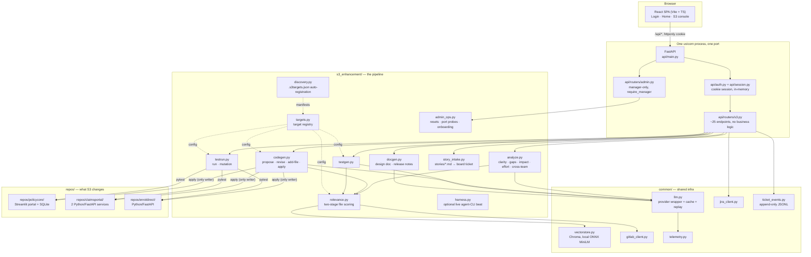
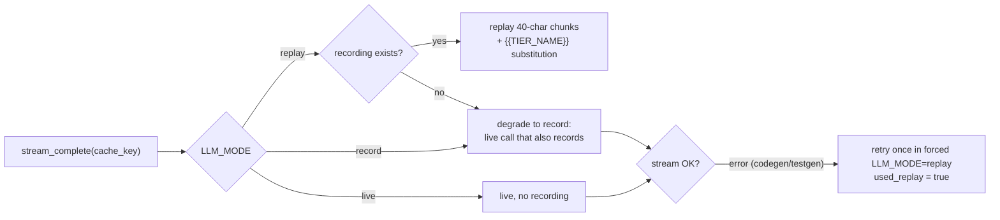
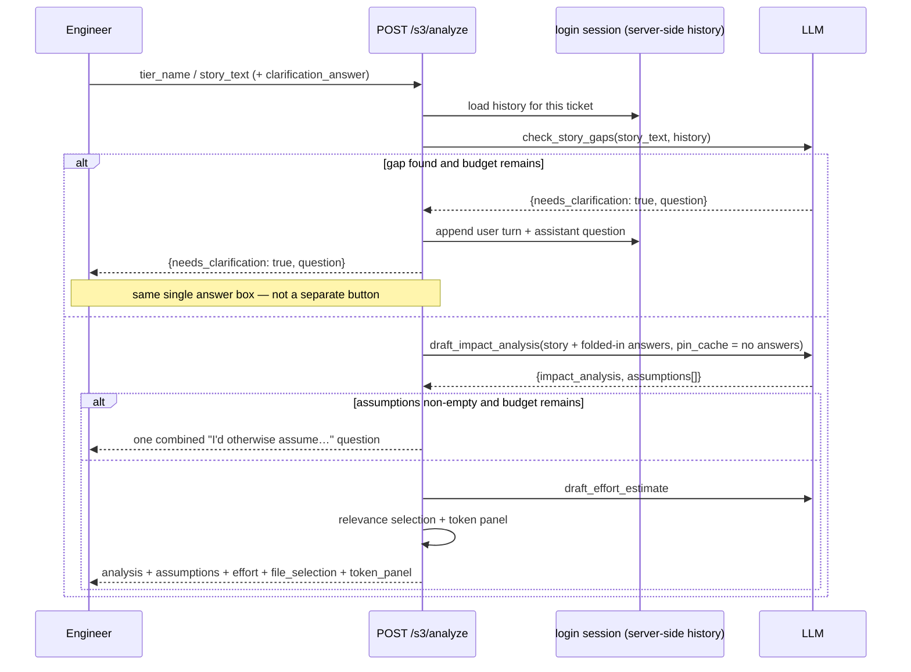
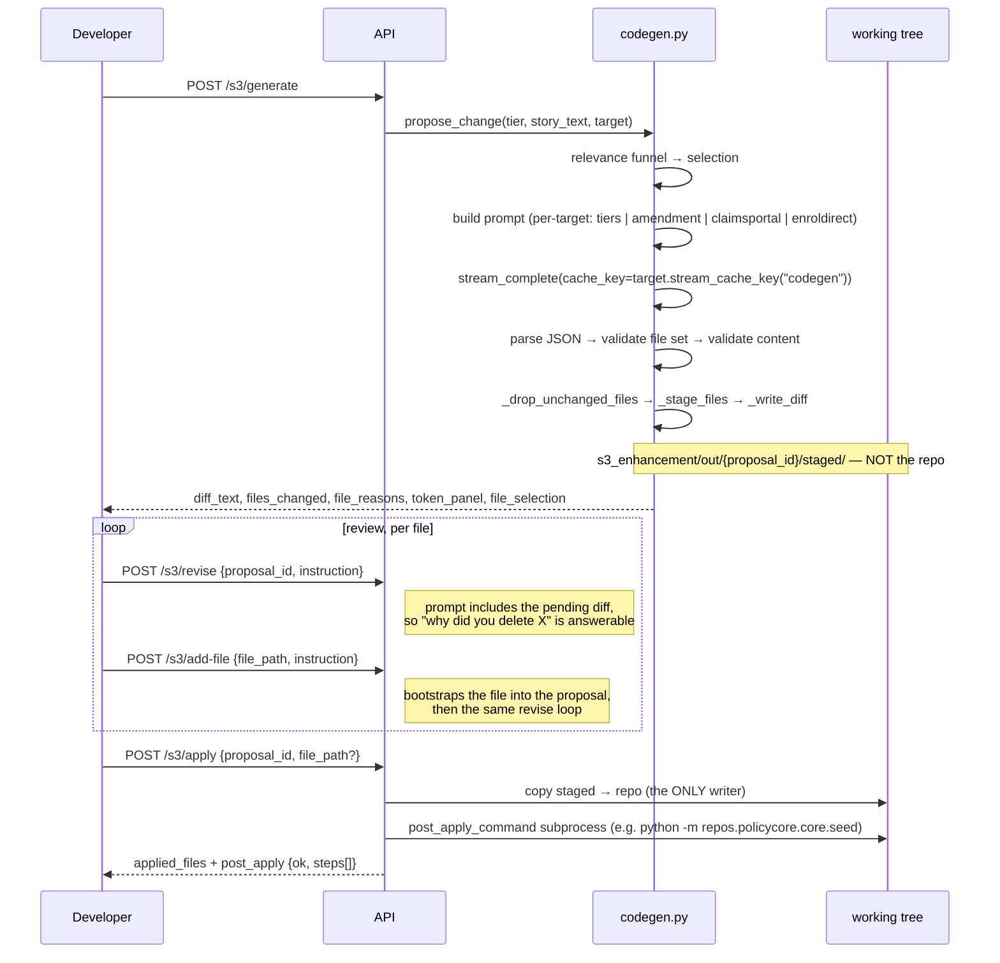

# S3 (Enhancement Delivery) — Technical Design

**Status:** current as of 2026-08-03 · **Scope:** the whole standalone S3 build in this repo
**Audience:** engineers extending this codebase, and presenters who need to explain what
the machine is actually doing on stage.

Companion docs: [`s3_llm_cost_controls.md`](s3_llm_cost_controls.md) (the cost rules new
LLM features must follow), [`../../CLAUDE.md`](../../CLAUDE.md) (project hard rules),
[`../history/`](../history/) (the original six-scenario background).

---

## 1. What S3 is

One user story travels end-to-end through an AI-assisted application-maintenance
pipeline, with a human gate at every step:

```
ticket → clarify → impact analysis + effort → propose code → review diff → apply
       → design doc → hand off to QA → generate tests → run → mutation check → release notes
```

The demo insurer is fictional (**MapleSure Insurance**) and the domain is group retirement
and group benefits — a *plan sponsor* holds a *group contract*, *plan members* enrol under
it, a change to an in-force contract is an *amendment*, and what the sponsor pays is a
*contribution*. Four registered user stories exercise the same pipeline against three different
applications:

| Ticket | user story | Target app | What the user story does |
|---|---|---|---|
| AMS-101 | US-2026-041 | `repos/policycore/` (MapleSure plan-administration portal) | Add a plan-tier upgrade capability (audience picks the top tier's name live) |
| AMS-102 | US-2026-042 | `repos/policycore/` | Add a `priority` field to the amendment request form |
| AMS-103 | US-2026-043 | `repos/claimsportal/` (ClaimsPortal, two FastAPI services) | Add deductible handling to claims decisioning |
| AMS-1045 | US-2026-045 | `repos/enroldirect/` (EnrolDirect) | Settle which access preference a prospect member resolves to at the enrolment gate |

All four are Python today; nothing in the pipeline assumes that (see §7.2 and §8).

The point of AMS-103 is architectural, not narrative: it proves the pipeline is not welded
to one repo or one test runner. AMS-1045 makes a second architectural point — its baseline
is a **removal**, not a missing feature. The checked-in state is the moment after the impact
analysis and before the gate acts on it, and `impact.py` is handed to the model as context
while being explicitly off its edit list, so "read the analysis, don't rewrite it" is
enforced rather than requested.

AMS-1045's key is derived, not seeded: any `stories/US-*.md` file becomes a board ticket
automatically (§3.1).

### Two folders, and why the split is load-bearing

`repos/` holds the repositories S3 **changes**; `apps/` holds the console and launch
scripts that **do the changing**. A directory dropped into `repos/` with a
`.s3targets.json` manifest registers itself as a target at import, with no code edit —
the contract is documented once, in [`../../repos/README.md`](../../repos/README.md).

### Design goals, in priority order

1. **It must not fail live.** Every external dependency (LLM, GitLab, Jira, embeddings,
   browser screenshots) has a committed replay recording and defaults to it.
2. **Nothing is unreviewed.** No AI output reaches the working tree, a ticket, or another
   team without a human action in between.
3. **Cost must be visibly bounded.** Prompt context is scoped by relevance, not dumped;
   conversations have a hard turn cap; every call is metered.
4. **It must port to a locked-down environment.** Plain Python + SQLite + a static SPA
   bundle. No Docker requirement, no cloud-managed services, pinned dependencies.

---

## 2. System context



**Deployment:** `npm run build` emits `apps/console/web/dist/`; `api/main.py` serves it as static
files with an SPA history fallback, so production is literally
`uvicorn apps.console.api.main:app --port 8000` — one process, one port. AWS EC2 bootstrap lives in
`deploy/aws/`, where `LLM_PROVIDER=bedrock` uses the instance role rather than a key in
`.env`.

**Do not run with `--reload`.** The pipeline writes `.py` files into the tree uvicorn
watches; the reload wipes the in-memory session dict and every subsequent request 401s
while the UI still looks logged in.

---

## 3. Core abstraction: the `Target` registry

`s3_enhancement/targets.py` is the seam that lets one pipeline serve many repos. A frozen
`Target` dataclass carries everything the pipeline needs to know about a repo/user story pairing:

| Field group | Fields | Used by |
|---|---|---|
| Identity | `target_id`, `display_name`, `source_kind` (`local`\|`gitlab`), `cache_namespace` | registry, cache keys |
| Source | `root`, `story_template_path`, `story_placeholder`, or `project_id`/`ref` | `relevance`, `story` |
| Scoping | `core_files`, `never_extra` | `relevance` |
| Contracts | `codegen_allowlist`, `testgen_allowlist`, `harness_expected_files` | `codegen`, `testgen`, `harness` |
| Execution | `language`, `test_command`, `test_cwd`, `post_apply_command` | `testrun`, apply endpoint |
| Demo beats | `mutations` (seeded revertible bugs) | `testrun.run_mutation` |

**Cache identity is the thing this protects.** `common/llm.py` builds its on-disk cache
path from the supplied `cache_key` alone, with *no hash of the prompt content*. Two targets
sharing a cache key would silently serve each other's recorded response — not an error, a
wrong answer. So `register_target()` raises at import time on a duplicate `target_id` or
`cache_namespace`. The legacy default target keeps `cache_namespace=""` and returns
verbatim historical key literals, so its committed recordings stay byte-identical.

```python
target.cache_key("impact_analysis")   # → "s3_impact_analysis:coverage_upgrade:v2"  (complete())
target.stream_cache_key("codegen")    # → "s3_codegen"                              (stream_complete())
```

**What a `Target` does *not* generalize:** the codegen/testgen *prompts* and *structural
validators* are per-user story business logic (exact API names, exact error wording, backward-compat
rules). `codegen._propose_change_once` dispatches on `cache_namespace` to pick one of four
prompt builders today, and there are four hand-written file-set validators to match.

### 3.1 Registration without a code edit

Two things a real onboarding needs, and neither should require editing this repo:

**`discovery.py` — the repo.** A directory under `repos/` carrying a `.s3targets.json`
manifest is turned into `Target`s and registered at import. The manifest is required rather
than inferred because `codegen_allowlist` (the blast radius), `core_files`,
`regression_paths` (the suite the pipeline is forbidden to write to) and `mutations` (which
quote generated code verbatim) are all *decisions*, not facts recoverable from source —
guessing any of them either widens the blast radius silently or makes the "the AI never
touched the independent check" claim untrue. A manifest that exists but cannot be parsed
**raises at import**; it is not skipped, because a repo shipping a manifest is asking to be
registered and a silent skip presents as "S3 didn't pick up my repo" with nothing to look
at. The full contract is in [`../../repos/README.md`](../../repos/README.md), documented
there once so it cannot drift between two copies.

A discovered target gets relevance scoping, user story→target routing, propose/apply/revert, the
regression beat and the mutation beat. It does *not* get a committed replay recording —
there is nothing to record against until its user story has run once, so its first codegen run is a
live call that records itself — and it does not get a bespoke structural validator; it falls
through to the generic `_validate_file_set`. Both are honest defaults. The four built-in
targets stay declared by hand in `targets.py` precisely because they own those bespoke
validators, and built-ins win on an id clash while two discovered repos colliding still
raises.

**`story_intake.py` — the ticket.** A `.md` file dropped into the top-level `stories/` becomes a
board row with nobody seeding a Jira ticket for it. The key is a pure function of the user story
identifier (`US-2026-045` → `AMS-1045`), because there is nowhere to persist a counter that
would survive `demo/reset_s3.sh`, and a key that changed between two board loads would
strand every event already recorded against the old one. Derived keys start at AMS-1000: the
seeded demo tickets (AMS-098, AMS-101..104) and `jira_client._synthetic_issue`'s replay keys
both live in AMS-100..999, so the band is provably collision-free and still readable from the
back of the room. The ticket lands in the default engineer's **To Do** column
(`s3.py::_story_default_assignee`, `STORY_DEFAULT_ASSIGNEE` — empty routes it to the
manager's unassigned queue instead), and the assignment is written to the ticket's event log
as a `system` actor so the timeline says how the holder came to hold it. Nothing in
the module calls an LLM, touches Jira, or writes anything — the router owns those decisions.

### File paths are a scoring input — never move a target

`relevance._document()` folds each file's path into the text it embeds
(`f"{rel_path} {content}"`), deliberately: the path carries subsystem/filename signal that
content alone loses across ~100 similarly-shaped decoy files. Renaming or moving a target
directory changes every embedding, reshuffles the selection, and desyncs it from the
committed codegen recordings — the beat then dies with
`LLMError: codegen returned unexpected file set`, in replay mode, offline, with no live
fallback. **Moving a target is a path-rewrite across code and recordings, not a rename.**

Done twice. First for the `apps/` restructure on 2026-07-28; then on 2026-08-03, moving all
three target repos out of `apps/` into the new `repos/` drop folder — 128 files rewritten
across code, docs and recordings together. The recordings carry target paths twice, as the
returned file keys and inside the generated code's own `import` statements, so both have to
be rewritten in the same pass. Both times every target was re-verified generate → apply →
revert afterwards, and **both times a live re-record was not required** — a weaker
constraint than this section previously assumed.

Two traps in the second move passed a `grep` and broke at run time: paths built as split
literals (`REPO_ROOT / "apps" / "policycore"`) are invisible to an `apps/policycore`
search, and files with unusual extensions (`.env.example`, `deploy/aws/*.service`) fall out
of an extension allowlist. Both bit on the first pass. Verify with an end-to-end run, not
with grep.

---

## 4. The relevance funnel — how scoring actually works

This is the heart of the technical story: *how does the AI decide which part of a large
codebase a user story touches, without reading all of it?*

`repos/policycore/` contains **58 discoverable source files** — 8 real Python files and 50
Java "decoy" files spread across 6 fictional legacy subsystems, each with its own
`DESIGN.md`. A seventh subsystem doc, `enrolment/DESIGN.md`, is *not* a decoy: it covers
real Python the portal uses, and it is there so the screen has to make a genuine judgement
rather than only sorting Java from Python. The funnel's job is to get from 58 to 4 without
ever opening the 50.

```mermaid
flowchart TD
  user story["user story text"] --> S1

  subgraph "Stage 1 — subsystem screening (prose vs prose)"
    S1["Read every DESIGN.md under the TARGET's root<br/>extract its '## Scope keywords' section"]
    S1 --> SC1["Embed + cosine-score each doc against the user story"]
    SC1 --> TH1{"score ≥ threshold?"}
    TH1 -->|no| OUT["screened_out —<br/>its source files are never opened"]
    TH1 -->|yes| IN[in_scope]
  end

  IN --> POOL
  OUT -.->|"prefix-excluded"| POOL

  subgraph "Stage 2 — file ranking"
    POOL["candidate pool =<br/>all files − core_files − never_extra − screened-out subsystems"]
    POOL --> SC2["Embed + cosine-score '{path} {content}' vs '{story-id} {story_text}'"]
    SC2 --> TH2{"score ≥ threshold?"}
    TH2 -->|yes| TOP["top max_extra (default 4) by score"]
    TH2 -->|no| DROP[dropped]
  end

  CORE["core_files —<br/>always included, always required back"] --> SEL
  TOP --> SEL["SelectionResult.selected<br/>→ the only file contents in any prompt"]
```

### 4.1 Two backends, two calibrated thresholds

Both stages prefer real semantic embeddings (`common/vectorstore.py` → Chroma with the
bundled ONNX MiniLM-L6-v2, no network at query time) and fall back to scikit-learn TF-IDF
cosine only if the vector store raises `VectorStoreError`.

The two backends' cosine scales are *not* comparable — embedding similarity for topically
unrelated text still sits well above zero, where sparse TF-IDF cosine sits near zero for the
same pairs. So each threshold is a `float | None`: `None` resolves to the floor calibrated
for whichever backend actually served the request.

| Stage | Constant | Embedding floor | TF-IDF floor | Measured decoy ceiling |
|---|---|---|---|---|
| Subsystem screen | `_SUBSYSTEM_*_MIN_SCORE_DEFAULT` | **0.45** | 0.05 | 0.354 (settlement, the closest decoy) vs ≤0.012 TF-IDF |
| File ranking | `_FILE_*_MIN_SCORE_DEFAULT` | **0.55** | 0.15 | 0.459 (`repos/policycore/core/claims.py` — domain-adjacent, not the subject) |

Both floors sit **above** the empirically measured decoy ceiling with margin, but are a
genuinely low bar otherwise: a subsystem or file that shares real terms with the user story clears
them easily, so real signal is never mistaken for noise. `tools/verify_s3_live.py` has two
checks (`check_decoys_never_selected`, `check_design_doc_gate_screens_all_legacy_subsystems`)
that fail the rehearsal gate if a calibration drift breaks either assertion — lower a
threshold only after re-running those.

### 4.2 Worked example — US-2026-041, live numbers

Measured 2026-08-03 against the checked-in baseline:

```
candidate_pool_size ....... 58   (python 8, java 50)

Stage 1 — subsystem scores (embedding cosine, floor 0.45):
  settlement    0.3539   ✗ screened out
  enrolment     0.2203   ✗   (real Python, not a decoy — screened on merit)
  risk          0.2071   ✗
  billing       0.2022   ✗
  underwriting  0.1945   ✗
  audit         0.1486   ✗
  reporting     0.1219   ✗
  → in_scope = ()  · screened_out = all 7  · 50 Java files never opened

Stage 2 — file scores over what survived (floor 0.55):
  repos/policycore/core/claims.py        0.4590   ✗ below floor (domain-adjacent, not the subject)
  repos/policycore/core/amendments.py    0.4413   ✗
  → extra_files = ()

selected = the 4 core files:
  repos/policycore/core/models.py · repos/policycore/core/db.py · repos/policycore/core/tiers.py · repos/policycore/app.py
```

Note `repos/policycore/core/tiers.py` **does not exist yet** — the user story creates it. It's still a
core file, passed to the prompt with empty content, and still required back in the response.

### 4.3 Screening is scoped to the target's own root

`discover_subsystem_design_docs(root)` globs `root`, and every caller with a
`Target` in hand passes `design_doc_root=target.root` through
`select_relevant_files`. Only the target-less callers (tests, `tools/`, the legacy
Streamlit console — all inherently mockapp-scoped) fall back to `repos/policycore/`.

This matters because a root with no design docs must yield `{}`, which
`screen_subsystems` turns into an empty screen that excludes nothing. Neither the
ClaimsPortal nor the EnrolDirect target has a `DESIGN.md` anywhere, so their screens are
correctly empty and the UI says "no subsystem doc matched closely enough — this change used
the user story's fixed core file list directly".

*Fixed 2026-07-27.* Screening previously globbed `repos/policycore/` unconditionally, so
the ClaimsPortal target was scored against mockapp's decoy subsystems and the panel
reported `repos/policycore/systems/legacy_platform/settlement` (0.49) as the part of
the repo the change was matched to — for a change that never touched mockapp.
Selection itself was unaffected (a `repos/policycore/systems/…/` prefix never matches a
`repos/claimsportal/…` path), but the reported answer was wrong on stage.
`test_non_mockapp_target_is_never_screened_against_mockapp_subsystems` locks it in.

### 4.4 Two escape hatches that override scoring

- **`core_files`** — always included as prompt context regardless of score, and always
  required back in the model's response (`verify_core_recall`, enforced in
  `codegen._validate_file_set`). This is the safety net that keeps the demo from flaking on
  the files the user story is actually about. EnrolDirect is the one target where the two lists
  come apart: `impact.py` is a core file *and* absent from the `codegen_allowlist`, because
  the model must read the analysis and must not edit it. Hence
  `_validate_enroldirect_file_set`, which requires recall over the editable core files only
  and fails loudly if a read-only file comes back modified.
- **`never_extra`** — structurally off-limits regardless of score. `repos/policycore/core/seed.py`
  scores *highest* of any candidate (it's the file most densely full of `Policy` field
  names) but constructs `Policy(...)` with 6 fixed positional args, so it must never be
  editable. It still counts toward `candidate_pool_size` for an honest "size of this app"
  figure.

### 4.5 GitLab: a third, cheaper pre-rank

For a real connected repo there are no design docs and no core-file contract, so
`discover_gitlab_files()` runs its own two-tier funnel:

1. `list_repo_paths()` — cheap, no content. Filter to source extensions, drop
   `node_modules/`, `vendor/`, `dist/`, `build/`, `.min.js`.
2. **TF-IDF over path segments only.** Each path is tokenized by splitting on `/`, `_`, `.`
   (`src/billing/export.py` → `"src billing export py"`), scored against the user story, and only
   the top `max_candidates` (default 20) have their content fetched at all.
3. Those 20 go through the normal `select_relevant_files()` with `core_files=()` and
   `design_docs={}`.

This pre-rank stays **TF-IDF-only on purpose**: it scores bare path segments, not prose, and
short literal path tokens are a poor fit for a sentence-embedding model built for
natural-language similarity. The economic claim it supports: a 20-repo GitLab account never
costs more than a handful of small HTTP GETs, regardless of any repo's size.

### 4.6 Token accounting — the scoped-vs-naive comparison

`naive_prompt_tokens()` answers "what would this same prompt have cost with the whole app
pasted in?"

```
naive = scoped_input_tokens + Σ estimate_tokens(content) for every *unselected* file
```

The naive prompt is the scoped prompt with every file substituted for the selected ones, so
it differs from what was actually billed by exactly the unselected files' contents —
everything else (system prompt, user story text, task instructions) is identical and must not be
dropped from one side. *(The earlier implementation summed all file bodies alone, comparing
a full prompt against bare source; on the ClaimsPortal target, where scoping selects every
file in the candidate pool, it reported the naive baseline as cheaper than what was actually
spent.)*

`estimate_tokens()` is a ~4-chars/token heuristic, **not** a real tokenizer — used only for
the illustrative comparison. A billed number always comes from the provider's own reported
usage, and any figure reconstructed from a replay recording is flagged `estimated: true` and
rendered with a `~` prefix.

### 4.7 How the scoring is shown in the UI

Two shared components render this identically everywhere it appears (Generate stage,
impact-analysis modal, cross-team impact), rather than drifting per page.

**`FileSelectionPanel.tsx`** — `_selection_dict()` from the API feeds it directly:

```
┌──────────────────────────────────────────────────────────────────────┐
│  Files in this app          Files used for this change               │
│  58                         4                                        │
│                                                                      │
│  Which part of the repo the AI matched this change to                │
│  ┌ no subsystem doc matched closely enough — this change used the    │
│  │ user story's fixed core file list directly, not a subsystem guess.        │
│                                                                      │
│  ▸ 7 other subsystems screened out as not relevant (not part of      │
│    this change)                                                      │
│      ┌───────────────┐                                               │
│      │ ~settlement~  │ ████░░░░░░░░░░░░  0.35   ← struck through,    │
│      │ ~enrolment~   │ ██░░░░░░░░░░░░░░  0.22     60% opacity        │
│      │ ~risk~        │ ██░░░░░░░░░░░░░░  0.21                        │
│      └───────────────┘                                               │
│  ▸ Selected source files                                             │
└──────────────────────────────────────────────────────────────────────┘
```

Design decisions baked into that rendering:

- Each subsystem gets a **proportional bar** (`width = clamp(score, 0, 1) × 100%`, capped at
  160px) plus the raw score to 2dp. Scores are *shown*, not hidden behind a verdict — a
  reviewer can see 0.35 was a near-miss and 0.12 was nowhere close.
- **Screened-out entries are collapsed by default**, struck through and dimmed, and labelled
  "not part of this change". Otherwise "why is a Java subsystem in my Python-only change?"
  is the first question a reviewer asks. In-scope rows use the accent colour; screened-out
  rows use the muted ink colour.
- When `in_scope` is empty (the normal case for US-2026-041, whose real files aren't behind
  their own design doc) the panel says so explicitly rather than rendering an empty list.

**`TokenPanel.tsx`** — three distinct renderings, chosen honestly:

| Condition | Rendering |
|---|---|
| `scoped_input_tokens == null` | "Token count unavailable for this run." |
| `naive / scoped < 1.05` | "…no saving over whole-app context here, since this change needed essentially every file." |
| otherwise | "Scoped context used ~N input tokens; a whole-app-context approach would have used ~M tokens — **3.4×** more." |

The `<1.05` branch exists because the old code floored the multiplier at 1× and rendered the
ClaimsPortal target's whole-pool selection as "1× fewer", which is dressing up a no-op.
Multipliers below 10× show one decimal — "3×" quietly rounds a third of the saving away.

---

## 5. LLM access layer

Every LLM call in the repo goes through `common/llm.py`. No provider SDK is imported
anywhere else; no provider-specific object, response shape, or parameter leaks past this
module — callers see `str` in, `str` out.

### 5.1 Provider resolution

`LLM_PROVIDER` wins if set (`anthropic` · `bedrock` · `openai` · `ollama`). Otherwise
auto-detect from which API key is present, preferring OpenAI when both are (leadership
steer). Bedrock and Ollama are never auto-detected — neither has a key to detect.

Bedrock uses `AnthropicBedrockMantle` (the Messages-API endpoint), so its request/response
shape is identical to the direct Anthropic client — that's why the two provider bodies stay
parallel. Credentials come from the standard AWS chain, so on the deployed EC2 box the
instance role is the intended path and nothing secret lands in `.env`.

Anthropic and Bedrock calls wrap the system prompt in a `cache_control: ephemeral` block:
every beat's system prompt is a fixed module-level constant reused verbatim, exactly the
shape prompt caching is for. OpenAI auto-caches server-side; Ollama has no equivalent.

### 5.2 Two independent cache paths

| | `complete()` | `stream_complete()` |
|---|---|---|
| Used for | short narrative/JSON drafts (analysis, effort, clarity, gaps, docs, repo match, chat) | long file generation (codegen, testgen) |
| Store | `.cache/llm/{sha256}.json` (gitignored) | `s3_enhancement/cache/{cache_key}.json` (**committed**) |
| Key | explicit `cache_key`, else hash of `(provider, model, system, prompt)` | literal filename from `cache_key` |
| Honours `LLM_MODE` | **No** — it's a cache, active in every mode | **Yes** — replay / record / live |
| Streams to UI | no | yes, 40-char chunks |

**Trap worth knowing:** a pinned `cache_key` ignores prompt content entirely — that's the
point of it, one recorded response per demo beat, every rehearsal. It also means a prompt or
logic change won't invalidate it. Clear `.cache/llm/` before live-retesting a pinned beat.
It's also why `draft_impact_analysis(pin_cache=False)` exists: after an engineer answers a
clarifying question, the re-draft *must* drop the pinned key, or it replays the pre-answer
analysis verbatim and keeps reporting the very assumption that was just resolved.

### 5.3 `LLM_MODE` and the replay-primary rule

Default is **`replay`** — recorded outputs are primary, live calls are the fallback, never
the reverse.



A missing recording degrades to a live call *that also records*, so the next run replays.
The older behaviour — raising on a missing recording — turned a cold cache into a dead demo
beat. And `codegen.propose_change` / `testgen.generate_tests` wrap the whole live attempt in
a `try/except LLMError` that retries under a temporarily forced `LLM_MODE=replay`, surfacing
`used_replay` to the UI. This is the fallback ladder:

1. **Live** model call.
2. **Replay** the committed recording (invisible to the audience; `used_replay` flag only).
3. **Harness replay** (`harness.py`, rung 2 of its own ladder) for the optional agent-CLI beat.

Recordings store the user story's `{{TIER_NAME}}` placeholder verbatim, so **one recording replays
for any audience-picked tier name** via plain string substitution — and the substitution
runs in *every* mode, so a record run never stages placeholder-bearing files.

The same `MODE` idiom is repeated deliberately across every external dependency:
`GITLAB_MODE`, `JIRA_MODE`, `HARNESS_MODE`, `SCREENSHOT_MODE`, `EMBEDDING_PROVIDER`.

### 5.4 Telemetry

`common/telemetry.py::log_call()` fires automatically inside `llm.py` on every call —
cached or not, tokens, latency, success, error — as JSONL at `.cache/llm/telemetry.jsonl`.
`scenario_of()` splits an `s3_codegen:...`-shaped key into `(scenario, beat)`.
`tools/cost_dashboard.py` reads it. **Cost is deliberately not computed from invented
pricing**: `MODEL_PRICING_USD_PER_1M` is empty until real contracted rates are filled in, so
every cost figure reads as unset rather than as a fabricated number presented as fact.

---

## 6. Clarification gates — "ask, don't assume"

The most-requested behaviour from the team review, and the subtlest part of the design.
There are **four** question sources, and they share **one budget of `MAX_CLARIFICATION_TURNS
= 2` questions per ticket**, not two each.

| Gate | Module | Runs on | Catches |
|---|---|---|---|
| 1. Clarity | `check_story_clarity` | ticket text alone | Ticket so vague that analysis would be misdirected entirely |
| 2. Gap | `check_story_gaps` | user story text alone | One *specific* missing detail: unstated threshold/percentage, eligibility criterion, field name/default, target system |
| 3. Repo identity | `repo_match.needs_confirmation` | user story + GitLab project list | Match below `high` confidence — scoping the wrong repo |
| 4. **Assumption** | `build_assumption_question` | the draft's *own declared assumptions* | Anything the model actually had to guess |

Gate 4 is the one that closes the loop. Gates 1–3 run *before* the analysis and can only
*predict* what the model might guess at; in practice they're wrong in both directions
(passing a user story the analysis then guesses about, or asking about a detail the user story already
states). Gate 4 reads what the model actually declared it assumed, so what gets asked is
exactly what would otherwise have been silently guessed — and the draft is **withheld** until
it's answered.

All assumptions go into a *single* question, not one each: the turn budget is shared, so
asking one-per-turn would silently drop the rest.



Design constraints worth preserving:

- **The turn cap is enforced server-side**, by counting prior assistant turns — never left
  to model discretion. Each prompt is also *told* when it has hit the cap and must answer
  `needs_clarification: false`. If a model asks anyway past the cap, that's an `LLMError`
  treated as a prompt bug, not a valid response.
- **History lives server-side** in the caller's own login session (`api/session.py`), keyed
  per ticket for `/analyze` and globally for `/analyze-adhoc` and quick-chat. The client only
  ever sends the latest message.
- **`_full_story_text()`** reconstructs the whole ticket from the transcript: after any
  clarification round, the incoming `story_text` is only the newest fragment (the engineer's
  answer), not the original ticket.
- **The "assumptions the AI made" box can only ever appear once the budget is spent** —
  never as the first thing the engineer sees. If it appears, it means the AI asked twice and
  still had to guess.
- **All four gates use the identical `{needs_clarification, question}` contract** and land in
  the *same* answer box in the UI — one continuous Q&A, not a wall of feature buttons.
- Repo identity degrades gracefully: if GitLab isn't reachable or the match call errors, the
  check is skipped entirely and analysis proceeds. It's a bonus signal, not a dependency.

---

## 7. Code generation, review, and apply



### 7.1 The review gate

`propose_change()` **never touches the working tree**. Staging goes to
`s3_enhancement/out/{proposal_id}/staged/` (gitignored). `apply_change()` is the single
function in the codebase that writes generated code to real files, and it's reachable only
from `POST /s3/apply`. Per-file apply (`file_path`) mirrors GitLab/GitHub's "Apply
suggestion" — safe to call again later for the rest; re-applying is a no-op copy.

Files the model returned byte-identical to the repo are dropped from the staged proposal
(`_drop_unchanged_files`) — validation still runs on the full response (core recall requires
every core file back), but review shouldn't show noise.

### 7.2 Validation layers

| Layer | Applies to | Checks |
|---|---|---|
| Shape | all | valid JSON, `files` list, string `path`/`content` |
| File set | all | core recall (`verify_core_recall`) + nothing outside `selection.selected` |
| Python content | `.py` (all four targets) | `ast.parse`, no legacy `typing.List/Dict/Optional` (ruff UP006/UP035) |
| Safety | all | denylist (`real client`, `end client`, `.env`, `api_key`, `secret`) + secret-shaped regex (`sk-…`, `AKIA…`, PEM headers) |
| US-2026-041 | `tiers.py`, `models.py` | required public symbols `PLAN_TIERS`/`TIER_MULTIPLIERS`/`upgrade_tier`; `Policy(...)` still constructible with 6 positional args |
| US-2026-042 | `models.py` | `Amendment.priority` is the **last** field and **has a default** |
| US-2026-043 | `claim_rules.py` etc. | `decide`/`payable` function defs exist (via `ast.walk`), required contract tokens; `policy.py`/`policy_client.py` carry `deductible` |
| US-2026-045 | `applicants.py`, `eligibility.py` etc. | core recall over the **editable** core files only, and a loud failure if the read-only `impact.py` comes back modified |

The backward-compat check actually `exec`s the generated `models.py` and constructs a
`Policy` with the exact 6 positional args `seed.py` uses — because `seed.py` is off the
allowlist and would crash the app on startup otherwise. All four targets are pure Python, so
`_validate_content` is a single `ast.parse` path with no per-language fork (the Java-specific
`_validate_java_content` brace/package-declaration gate this table used to describe was
deleted along with the non-Python target). Nothing in the design assumes that stays true —
adding a language means a `Target.language` branch here and a runner that emits JUnit XML,
not a rewrite.

### 7.3 Two behaviours worth calling out

**Docstring restoration (`_restore_module_docstring`).** Whole-file replacement makes models
silently shed the leading module docstring, and no prompt rule reliably stops it — asked
about the deletion they deny it; told to fix it they echo the same content back while
reporting success. Since no user story ever asks to delete a docstring, its disappearance is treated
as an artefact of the format and repaired deterministically in code.

**Showing the model its own diff.** The revise prompt includes the pending unified diff,
because otherwise the model only ever sees the *post*-change file and cannot tell what it
removed — asked "why did you delete X?" it answers from the only text it has and confidently
denies the removal. With the diff, "what changed and why" is answerable from evidence, and
the prompt explicitly instructs it to read the `-` lines and never claim something is still
there when the diff shows it removed.

**Post-apply migrations** are registry-driven, matched by target *root* rather than target
id: a proposal's file paths identify which local app they belong to, and every registered
target rooted there contributes its `post_apply_command`. Sibling targets inherit each
other's migration step, so a new mockapp user story is covered for schema drift before its author
thinks about it. Failures surface to the caller with their output tail (`post_apply.ok`),
rather than dying silently in a discarded subprocess.

---

## 8. Tests: generate → run → prove

Three separate beats, because "the AI wrote tests and they passed" is a weak claim on its
own.

1. **`POST /s3/tests/generate`** — streams the test file, validates it (`ast.parse`, same
   denylist), and stages it. Note that unlike codegen, testgen *does* apply to the tree
   immediately — a test file is not a change to the product.
2. **`POST /s3/tests/run`** — runs the target's own runner and parses **JUnit XML** into
   per-case results, so the console renders a checklist instead of a raw runner dump:
   - The default (all four registered targets): `pytest <path> -v --junitxml=<tmp>
     -o junit_family=xunit2`
   - A target can instead declare an external `test_command`/`test_cwd` (an escape hatch for
     a non-Python target, unused today — ClaimsPortal's Maven/JUnit invocation used this path
     until its 2026-07-30 rewrite to Python)
   - `humanize_test_name()` turns `test_unknown_tier_raises_value_error` into a readable label
   - A run whose XML never appeared still returns, with an empty case list and the real
     return code
3. **`POST /s3/tests/mutation`** — the "prove the tests catch bugs" beat. Injects the
   target's seeded, declaration-ordered `Mutation` (e.g. weakening `<=` to `<` in the
   deductible boundary check), re-runs the suite, and **always restores the original content
   in a `finally`** — the working tree is byte-identical afterwards no matter how the run
   ends. A mutation whose `old_snippet` has drifted out of the generated code is skipped,
   never guessed at; if none match, the beat fails loudly (409) rather than mutating blind.

---

## 9. API surface

All routes are under `/api` — deliberately, so a client route like `/s3` never collides with
the backend router of the same name. Every route depends on `require_identity`, which 401s
before any handler body runs; the admin routes and ticket assignment depend on
`require_manager` on top of it.

| Method | Path | Purpose |
|---|---|---|
| GET | `/auth/roster` · POST `/auth/login` · `/auth/logout` · GET `/auth/me` | fictional roster login, httponly cookie |
| GET | `/s3/reset-marker` | changes only on `demo/reset_s3.sh`; lets the SPA drop stale localStorage |
| GET | `/s3/story` | render a user story template with the audience-picked tier name |
| POST | `/s3/analyze` | gap gate → impact + assumptions + effort + file selection + token panel |
| POST | `/s3/analyze-adhoc` | clarity → gap → repo-identity gates, then analysis with no codebase context |
| POST | `/s3/impact/cross-team` | AI-suggested other affected teams (human confirms before any ticket) |
| POST | `/s3/generate` · `/s3/revise` · `/s3/add-file` · `/s3/apply` | the propose → review → apply loop |
| POST | `/s3/design-doc` · `/s3/release-notes` | narrative artifacts |
| POST | `/s3/tests/generate` · `/s3/tests/run` · `/s3/tests/mutation` · `/s3/tests` (legacy) | the test beats |
| GET | `/s3/jira/board` · `/s3/jira/dependencies` · `/s3/ticket-events` | board (including rows derived from `stories/*.md`), cross-team dependencies, activity feed |
| POST | `/s3/jira/cross-team-ticket` · `/problem-record-ticket` · `/ticket-status` | the only Jira writes, all human-confirmed |
| POST | `/s3/jira/assign-ticket` | **manager only** — assign, reassign, or unassign |
| GET | `/admin/status` · `/admin/reset/{scope}/preview` · `/admin/logs` | **manager only** — service probes, what a reset would do, log tails |
| POST | `/admin/reset` · `/admin/services/{id}/{action}` · `/admin/repos/onboard` · DELETE `/admin/logs` | **manager only** — the admin panel's writes |
| GET | `/s3/gitlab/projects` · POST `/s3/gitlab/projects/{id}/scope` · `/s3/gitlab/scope-auto` | read-only real-repo scoping beat |
| POST | `/s3/chat/quick-impact` | free-text "how much would this cost" chat |
| GET | `/s3/harness/latest` · `/s3/screenshots/{stage}` | optional agent-harness and before/after PNG beats |

Error mapping is uniform: `LLMError` → **502**, `GitLabError`/`JiraError` → **502**, invalid
tier name → **422**, missing precondition (no generated test file, no matching mutation) →
**409**, missing artifact → **404**. Every AI-produced response carries
`label: AI_SUGGESTION_LABEL` ("AI suggestion — verify with your specialist before applying.").

The router is deliberately **thin**: no business logic, every function it calls is the same
one the original Streamlit view called.

### 9.1 Who may reassign is decided server-side

Assignment used to be set-once, and the "once" was a **UI-only** gate:
`POST /s3/jira/assign-ticket` had no role check at all, so anything that could reach the
endpoint could assign any ticket to anyone. The endpoint now assigns, reassigns and
unassigns, and decides who may do it from the ticket's *current assignee*, read server-side:
a manager may do anything; anyone else may pick up an unassigned ticket or hand on a ticket
already assigned to them, and gets a **403** naming the current holder otherwise.

It is deliberately not `require_manager`. The QA hand-off is the reason: the engineer assigns
the tester and moves the ticket to QA themselves, which a blanket manager-only gate answers
with "Manager role required" at the hand-off card. What the rule actually refuses is one
person taking a ticket **off** a third party, which is the thing worth refusing.

The same rule *permits* the return leg — a tester holding a ticket may hand it back to the
engineer — but **the console has no control for it yet**: the Reassign dialog in
`BoardStage.tsx` renders under `isManager` only, so today a failed test is handed back by a
manager, or by a tester calling the endpoint directly. The QA-fail round trip is on the
client's 2026-08-03 walkthrough list and is not built.

Tickets derived from `stories/*.md` land on the default engineer (§ story intake), so the
common case needs no routing step at all; a manager reassigns when the default is wrong.

Same rule as the release record's approvals and the commit gate: a claim about *who* is
responsible is read and written server-side, never asserted by a client.

### 9.2 The admin panel — what it refuses to do

`/api/admin/*` over `s3_enhancement/admin_ops.py`. Four jobs the presenter would otherwise
open a terminal for: reset demo state, clear logs, see and control the target apps, onboard
a repo. Three rules shape the module, and the limits they produce are part of the design:

- **A reset must never silently discard work.** Over a terminal `git checkout HEAD -- …` is
  a considered act; over HTTP it is a button. Every source-restoring scope is previewed
  against `git status` first and **refused with a 409 while the paths it would overwrite are
  dirty**. Delete-only scopes touch nothing but generated state and stay allowed. There is
  no "reset everything" scope — seven explicit ones (`policycore`, `claimsportal`,
  `enroldirect`, `tickets`, `logs`, `proposals`, `caches`), and you name one.
  `.cache/vectordb` is deliberately in none of them: rebuilding the embedding index can mean
  live embedding calls, the opposite of what a mid-demo reset should risk.
- **Never build a shell command by string interpolation.** Reset scripts run as
  `[bash, <absolute path>]` with a fixed argument list and no shell; delete-only scopes are
  reimplemented in Python and never shell out at all.
- **Report what is true, not what was attempted.** `up` is a plain TCP connect to
  `localhost:<port>` — no `ps`, no `lsof`, no `/proc` — so it survives the locked-down host
  design goal 4 requires. After a start or stop the port is re-probed and the *probe*
  decides `ok`, not the `Popen`/`kill` return. Where process control genuinely isn't
  available, the answer is `ok: false` plus the exact command an operator should run. Same
  posture `scm.py` takes with `simulated`.

Two consequences worth stating out loud: **there is no service id for the console** — naming
it is a 400, not an attempt, because it cannot restart the process serving the request — and
**a written manifest needs a console restart** before the target registers, since discovery
runs at import.

The panel is also where an unrestorable reset surfaces before it runs. `demo/reset_s3.sh` and
`reset_s3_endorsement.sh` restore with `git checkout HEAD -- repos/…`, which can only restore
paths HEAD already has — so moving a target breaks them until the move is committed, and the
checkout fails with "pathspec did not match". `head_missing_paths()` detects that with
`git cat-file -e HEAD:<path>` and reports a named `reset_blocked_reason` instead of letting a
raw git error out of a button; committing the move is the fix. The check is not tied to any
one move — it is the standing guard for the next one. ClaimsPortal and EnrolDirect restore by
copying their `.baseline/` snapshots and never depend on HEAD.

---

## 10. Frontend

React 19 + Vite + TypeScript. Four pages — Login, Home, S3, and `/admin` — plus shared
components. The S3 console is **one route per pipeline stage** (`/s3/board`, `/target`,
`/generate`, `/design-doc`, `/tests`, `/release`) behind a persistent left-hand stage rail,
with a stage that isn't unlocked yet unopenable:

| Stage | Unlock condition |
|---|---|
| 1 · Generate | a ticket assigned to you is selected · impact analysis has run for it · **no open cross-team dependencies** |
| 2 · Design doc | the proposal has been applied (or had nothing to apply) |
| 3 · Tests | design doc drafted · ticket status is **QA** · **you are the assigned tester** |
| 4 · Release notes | tests have run · (if in QA) you are the assigned tester |

The QA gate is a real segregation-of-duties statement, not decoration: *the developer who
wrote the change does not get to verify it*. A tester logs in separately, and the pipeline
resumes mid-flight because per-ticket state persists in `localStorage`
(`ams-s3:ticket:{key}`) — analysis, proposal, applied-file map, per-file chat transcripts,
design doc, test artifacts. Server-side staged proposals under
`s3_enhancement/out/{proposal_id}/` survive too, so "Ask"/"Apply" on a restored proposal
still works as long as the backend process hasn't restarted.

The cross-team dependency gate reads from the append-only ticket-events log rather than
client state, so one engineer's screen sees a dependency clear after *another* team, logged
in separately, marks their ticket Done.

`GET /s3/reset-marker` closes the loop with `demo/reset_s3.sh`: the marker changes only on
reset, and the SPA drops its cached per-ticket state rather than showing results for a
ticket the server no longer has any record of.

`/admin` renders as four cards (`pages/Admin.tsx` + `pages/admin/`) mirroring §9.2: reset by
scope, logs, services, onboard. It shows what a reset would restore and delete, and why it
is blocked, *before* offering the button. Route-level protection is a convenience only —
the API is the gate.

### 10.1 Artifacts open in a modal

Client feedback on the earlier build was that there was too much on screen at once: *"there
is a lot of data on the screen… open it in a pop-up."* So the long AI-produced artifacts —
release notes, deployment plan, design doc, scenario table, generated and executed test
checklists, mutation diff, traceability matrix — render inside `Modal`
(`pages/s3/components.tsx`) rather than expanding down the page. What stays in the main flow
is what a presenter narrates: the action buttons, the verdict line, the token-cost line. The
stage rail is unchanged.

`Modal` is mount-to-open — the caller renders `{open && <Modal …/>}` — so focus handling and
the escape key live in one place rather than in each stage. Adding a new artifact means
adding a modal, not another expanding panel.

---

## 11. Guardrails and data handling

- **Synthetic only.** No real client data anywhere; the insurer is fictional. Generated
  content is denylist-scanned for `real client` / `end client` and secret-shaped strings
  before it can be staged.
- **Keys via `.env` / environment only**, never hardcoded, printed, or committed. On EC2 the
  Bedrock path uses the instance role so no key exists on the box.
- **Human-in-the-loop by default.** Every AI output is labelled and gated. The one thing the
  AI writes without a human action is `add_file`/`revise` output into the *staging* area,
  which is still not the repo.
- **Path traversal.** `_safe_repo_relative_path()` resolves developer-supplied paths against
  `REPO_ROOT` and rejects absolute paths, `..`, and symlink escapes — needed because that
  path (unlike the LLM-selected ones, constrained to a fixed allowlist) is about to be read
  from and written into the tree.
- **Session model.** In-memory, single-process, httponly cookie, `samesite=lax`. Explicitly
  not production auth — matching Streamlit's own posture, where a process restart was
  already a reset event.

---

## 12. Verification

- **`pytest tests/`** — 679 tests, ruff clean. Covers relevance scoring and threshold
  behaviour, codegen validators and docstring preservation, clarity/gap/impact gates, test
  parsing, target registry, manifest discovery, user story intake, admin operations, API routes, and
  the explicit `test_autofix_no_git_writes.py` / `test_s3_scm.py` guarantees. `tests/` also
  holds the three targets' human-authored regression suites, which the pipeline is forbidden
  to write to — `tests/test_s3_testrun.py` asserts they never appear in any allowlist, and
  that assertion is the whole value of the regression beat.
- **`tools/verify_s3_live.py`** — the live-demo rehearsal gate, in two layers:
  - *Architecture checks* (run offline with `--skip-live`): replay works with networking
    stubbed out entirely; a mid-stream provider failure falls back to replay invisibly; one
    recording replays correctly for two different tier names; `demo/reset_s3.sh` restores
    baseline in <10s; core recall never drops a required file; decoys are never selected;
    the design-doc gate screens out every legacy subsystem.
  - *Live checks*: the narrative drafts run 5× against the real provider and must be
    structurally sound every time — graded for *structure*, not quality, since grading
    quality would need another LLM and reintroduce the non-determinism this tool exists to
    catch.
  - `--gate N` runs N full live codegen+testgen+pytest cycles from baseline. A cycle passes
    only if the **live** path succeeded (no silent replay fallback) and the tests ran green.
    **Demo-day rule: ≥ 9/10 consecutive live passes, or present in `LLM_MODE=replay` without
    hesitation.**
- All tree-mutating checks restore committed state before exiting.

---

## 13. Extending it

**Onboarding a new repository — the no-code path.** Drop the source in as `repos/<name>/`,
put its user stories in the top-level `stories/`, add `repos/<name>/.s3targets.json`, and keep its
human-authored regression suite in the top-level `tests/` (anything ending `.py` under a
repo root joins the codegen candidate pool, which would let the pipeline write to the one
independent check that a user story broke nothing). That is the whole procedure; the manifest
contract is in [`../../repos/README.md`](../../repos/README.md). Restart the console so
discovery re-runs. The board picks the user stories up on its own.

**Adding a new user story against an existing built-in target root:** register a `Target` with a
unique `cache_namespace`, add the user story file, write its prompt builder and structural validator
pair, add a `Mutation`, and warm the caches (`demo/warm_s3_cache.sh`). Post-apply migrations
are inherited from siblings on the same root automatically.

**Adding a new language:** set `Target.language`, `test_command`, and `test_cwd`; add a
content validator branch in `codegen._validate_content`; confirm the runner emits JUnit XML
(`testrun` parses only that schema).

**Known limitations / open items:**

- Codegen prompts and structural validators are per-user story business logic — four built-in
  targets means four prompt builders and four validators. A discovered target falls through
  to the generic validator, which is honest but weaker. This is the main thing that would
  need real work to scale to a 30-repo estate.
- A discovered target has no committed replay recording until its user story has been run once, so
  its first codegen run is a live call. Warm it before presenting.
- Sessions are single-process and in-memory; a multi-worker deployment needs a shared store.
- `MODEL_PRICING_USD_PER_1M` is empty by design; cost totals read as unset until real rates
  are supplied.
- Live codegen against a GitLab-hosted target is deliberately not supported — that path is
  read-only discovery/relevance preview, and nothing is ever written back to GitLab.
- `demo/reset_s3.sh` and `demo/reset_s3_endorsement.sh` restore from `HEAD`, so they can only
  restore paths HEAD already has: **a target move breaks them until it is committed** (§9.2).
  The admin panel names the reason rather than failing halfway; the two `.baseline/`-based
  resets never depend on HEAD.
- `deploy/aws/` deploys the console and PolicyCore only — there are no systemd units for
  ClaimsPortal's two services or EnrolDirect.
